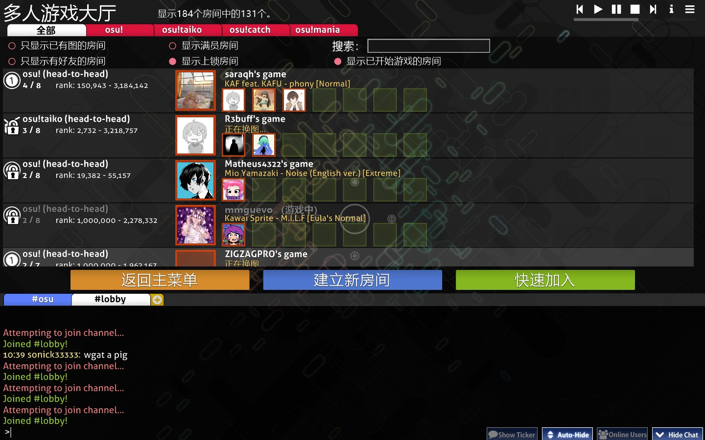
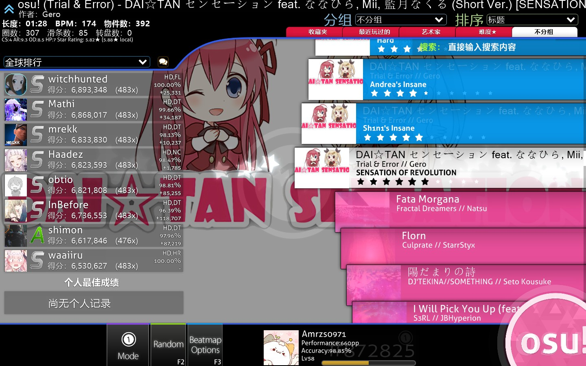
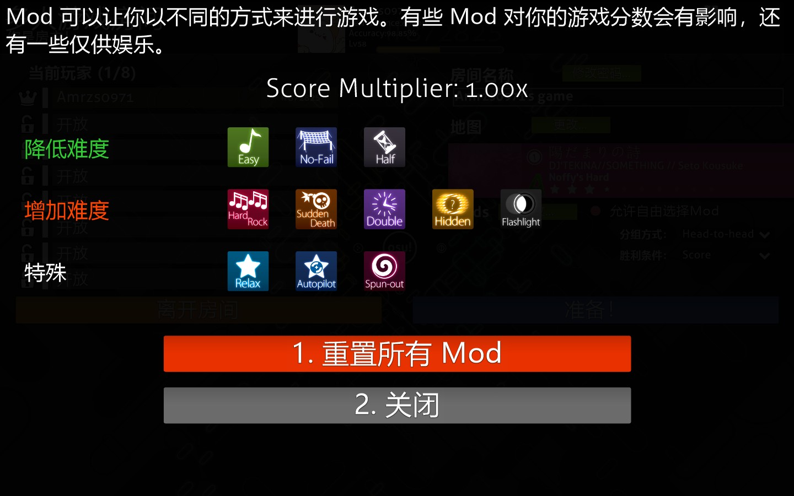

<!-- TODO: needs further rewrite, see https://github.com/ppy/osu-wiki/issues/7165 -->

# 多人游戏

**多人游戏** （**Multiplayer**，有时简写为 *Multi*）是一个游戏模式，最多允许 16 位玩家参加，他们可以单独或组队对抗，也可以一起合作游玩，游玩的谱面由房主决定。

[osu! 学院](/wiki/Community/Video_series/osu!academy)的[第 6 集](https://www.youtube.com/watch?v=QPTLyG7O8ak)视频中包括了这部分内容，除此之外还介绍了[online users panel](/wiki/Client/Interface/Chat_console#扩展聊天面板)的相关内容。

## 游玩方法

*注意：需要 [osu! 账号](/wiki/Registration)来参加多人游戏，[已禁言](/wiki/Silence)的玩家无法参加。*

在主菜单中，可以通过如下步骤进入多人游戏大厅：

1. 点击 `Play` 按钮，或者按 `P` 键。
2. 点击 `Multi` 按钮，或者按 `M` 键。

## 大厅

*注意：当使用`测试版`版本时，需要活跃的[osu! 支持者](/wiki/osu!supporter)标签来进入多人游戏大厅。*

进入大厅后，玩家会看到目前所有可用的比赛房间。

### 筛选器设置

可以使用界面左上方的设置项，对列出的比赛房间进行筛选。

| 名称 | 描述 |
| :-: | :-- |
| `全部` / `osu!` / `osu!taiko` / `osu!catch` / `osu!mania` | 只显示选中[游戏模式](/wiki/Game_mode)的房间，也可以显示所有游戏模式的房间。 |
| `只显示已有图的房间` | 只显示玩家拥有已选中[谱面](/wiki/Beatmap)的房间。 |
| `显示满员房间` | 显示无可用空位的房间。 |
| `搜索` | 使用搜索栏搜索选中的某个谱面或房主用户名。当搜索时，除`显示已开始游戏的房间`外的所有筛选器都会被临时禁用。 |
| `只显示有好友的房间` | 只显示玩家好友所在的房间。此筛选器在启用时，会覆盖所有其他的筛选器。 |
| `显示上锁房间` | 显示需要密码进入的房间。 |
| `显示已开始游戏的房间` | 显示目前正在游戏中的房间。如果房间有空位，则仍然可以进入。这类房间的名称为灰色，在游玩结束前末尾都会显示`（游戏中）`。 |

### 比赛

屏幕中部列出了可用的比赛房间。

大多数房间的背景是亮白色的，说明它们[正常使用游戏界面建立](#建立新房间)。也有紫色背景的房间，它们是通过[房间管理聊天命令](/wiki/osu!_tournament_client/osu!tourney/Tournament_management_commands)（如 `!mp make` 或 `!mp makeprivate`）建立的*锦标赛房间*。

每个房间会显示多条信息。比如，房间右侧的玩家栏可以显示三种不同颜色：

| 颜色 | 描述 |
| :-: | :-- |
| 红色 | 此槽位有玩家占用。 |
| 绿色 | 此槽位可用。 |
| 无色 | 此槽位已被锁定。 |

点击任一比赛房间即可加入其中。

### 常规选项

[聊天面板](/wiki/Client/Interface/Chat_console)上方的三个按钮提供了大厅的主要导航选项：

| 名称 | 描述 |
| :-: | :-- |
| `返回主菜单` | 离开大厅并回到主菜单。 |
| `建立新房间` | 建立新房间，细节请见下文。 |
| `快速加入` | 以玩家目前的[表现分排名](/wiki/Ranking#performance-points-ranking)为基准，*随机*加入可用比赛。 |

## 建立新房间

::: Infobox

:::

| 名称 | 描述 |
| :-: | :-- |
| `Game Name（房间名称）` | 比赛房间名称，默认值是 `{账户名}'s game`。 |
| `Require password to join（加入时需要密码）` | Make the match private. |
| `Password（密码）` | Set a password for the match. Only appears if the `Require password to join` button is enabled. |
| `Make match history publicly viewable（比赛记录公开可见）` | Allow players other than match participants to view the match history via direct link. Only appears if the `Require password to join` button is enabled. |
| `Max Players（最大玩家数）` | The total number of players (including the host) allowed to join the match. A range from 2 to 16 can be selected, with a default of 8. This can be adjusted later by locking/unlocking player slots. |

Pressing the `1. Start Game` button will create the match with the currently playing song as the beatmap. The `2. Cancel` button brings the player back to the lobby.

## 比赛设置

::: Infobox

:::

After going into or creating a match, the match setup will be displayed. The following sections will focus on the different parts of the screen starting from top to bottom and going left to right.

While there is no direct button for it, the [options menu](/wiki/Client/Options) can still be accessed by pressing `Ctrl` + `O` while in a match lobby.

### Header section

The top-left text indicates whether the player is the match host or a normal player. In the middle, there is a player box with information about [performance points](/wiki/Performance_points/Total_performance_points), [overall accuracy](/wiki/Gameplay/Accuracy), [level](/wiki/Gameplay/Score/Total_score#level), [rank](/wiki/Ranking#performance-points-ranking) and the selected [game mode](/wiki/Game_mode). To the right is a button for pausing the currently playing song.

### 当前玩家列表

::: Infobox

:::

The player list shows all slots for a match. The numbers in parentheses to the right of `Current Players` show the number of players in the match over the amount of unlocked player slots.

Available slots can be moved between by clicking on them, but slots indicated with a closed lock are not accessible. The host is able to lock and unlock slots through the icons on the left, as well as kick players. Host privileges can be transferred to another player by right-clicking and pressing `Transfer host privileges`. The team colour can be changed between blue and red when playing Team VS.

Hovering above any player on the list will show the level, country and [overall accuracy](/wiki/Gameplay/Accuracy) of the player in question.

A player can have four different colours in this list, which also mean different things:

| 颜色 | 描述 |
| :-: | :-- |
| **红色（没有地图）** | The player does not have the beatmap, indicated by a `[no map]` notice until they have downloaded the beatmap. |
| **白色（未准备好）** | The player has the beatmap but is not ready yet. [Game modifiers](/wiki/Gameplay/Game_modifier) can be changed in this state. |
| **绿色（已准备好）** | The player is ready. Game modifiers cannot be changed in this state. The host will be able to start the game after readying, and any ready players will begin the match. |
| **浅蓝色（游玩中）** | The player is playing, indicated by a `[playing]` notice until the match ends. |

### 比赛设置

#### 比赛名称与密码

The `Game Name` is the name of the lobby that is visible in match listings in-game and on the website. Having a password is useful for restricting the lobby to friends or tournament players, and can be changed using the `Change Password` button above the game name.

#### 谱面

::: Infobox

:::

::: Infobox

:::

The beatmap section shows the beatmap to be played in the match. Changing the beatmap using the button above it opens the song selection screen.

The beatmap card will show the background image, game mode icon, 名称 and artist of the song, creator of the beatmap, the selected [difficulty](/wiki/Beatmap/Difficulty), and the [star rating](/wiki/Beatmap/Star_rating) for the selected beatmap.

::: Infobox

:::

When hovering over the beatmap, there is a popup that displays information about the beatmap. These are as follows:

| 值 | 描述 |
| :-: | :-- |
| `BPM` | 每分钟拍数 |
| `Length` | 谱面长度 |
| `Last Played` | 上次游玩谱面的时间 |
| `CS` | 圆圈大小 |
| `AR` | 缩圈速度 |
| `OD` | 判定严度 |
| `HP` | 掉血速度 |
| `Stars` | 星数评价 |

如果玩家没有对应谱面，则会给出如下状态之一：

| 谱面状态 | 描述 |
| :-: | :-- |
| `Ranked` / `Approved` / `Pending` / `Graveyard` | The [beatmap category](/wiki/Beatmap/Category). Clicking on the beatmap card will open the beatmap page on the website, where it can be [downloaded](/wiki/Beatmap#downloading-beatmaps). |
| `Not uploaded or not up-to-date` | The beatmap is not available for download. The host should find the link (in the [beatmap listing](https://osu.ppy.sh/beatmapsets)) for the player if the issue persists. |
| `Cannot update the beatmap` | The host is playing a modified version of the beatmap. |

#### 模组

::: Infobox

:::

This section will show the [game mods](/wiki/Gameplay/Game_modifier) used for this match.

The host can enable `Free Mods` to allow players to freely choose any mod combination, except ones that change gameplay speed ([Double Time (DT)](/wiki/Gameplay/Game_modifier/Double_Time), [Nightcore (NC)](/wiki/Gameplay/Game_modifier/Nightcore) and [Half Time (HT)](/wiki/Gameplay/Game_modifier/Half_Time)).

#### 组队模式 {id=team-mode-match-setup}

*For more information about team modes, see the [gameplay section on team modes](#team-mode-gameplay).*

可以使用以下四种组队模式进行比赛：

| 组队模式 | 描述 |
| :-- | :-- |
| `Head-to-head` | 相互比拼，竞争榜首。 |
| `Team VS` | 组队（红队和蓝队）比拼，获得胜利。 |
| `Tag co-op` （仅限 osu! 模式，不计入排名） | 一起完成谱面，一次打一串连击。 |
| `Tag-team VS` （仅限 osu! 模式，不计入排名） | The same as `Tag co-op`, but with two teams competing against each other. |

##### Tag 颜色

::: Infobox

:::

If the team mode was set to `Tag co-op` or `Tag-team VS`, a `Tag Colour: (combo colour)` section will be shown which allows choosing a custom colour for each player. Setting this to `Default` will use the beatmap's original combo colours.

#### 获胜条件

There are four different ways the winner of a match can be decided:

| 名称 | 描述 |
| :-: | :-- |
| `Score` | The player with the highest score wins. |
| `Accuracy` | The player with the highest accuracy wins. If there are two players with 100.00%, the player with the highest score (from spinners) wins. Otherwise, it is a tie. |
| `Combo` | The player with the highest combo count *at the end of the beatmap* wins. If the combo count is the same, the player with the highest score wins. The maximum combo is not counted in this case. |
| `Score v2` | The player with the highest (standardised) score wins. |

### 比赛设置按钮

[聊天面板](/wiki/Client/Interface/Chat_console)上方有两个大按钮，分别是橙色和蓝色的。

The orange `离开房间` button on the left is self-explanatory. If the match host leave the match, the host will be automatically transferred to the remaining player in slot order. If there is no one in the match, it will automatically close, except for ones made by [`!mp` commands](/wiki/osu!_tournament_client/osu!tourney/Tournament_management_commands), which will instead close after 30 minutes.

The blue button is used to control the player ready state and to start the match.

| 名称 | 描述 |
| :-: | :-- |
| `准备！` | 将玩家标记为已准备好（在玩家列表中显示为绿色）。The button will change to `取消准备`. For the match host, it will change to either `开始游戏！` or `强制开始游戏！` if there are players in the lobby. |
| `取消准备` | Marks the player as not ready (white on the player list). The button will change to `准备！` |
| `开始游戏！` | Starts the match. This button only appears for the match host when all players are ready. |
| `强制开始游戏！({准备好玩家数}/{总玩家数})` | Starts the match even if not all players are ready. This button only appears for the match host when some players are ready. The amount of ready players compared to the total amount of players is shown in parentheses. |

### 比赛历史

::: Infobox

:::

The bottom section of the screen is the [chat console](/wiki/Client/Interface/Chat_console). Every match has its own channel in a tab called `#multiplayer`, with [BanchoBot](/wiki/BanchoBot) providing a link to the match history on the first line.

For Head-to-head matches, the result will be displayed privately in another tab called `#userlog` upon conclusion, where BanchoBot says `你在 {总人数} 人的多人游戏中排名第 {名次} 位（{谱面} [难度] <游戏模式>）。`

## 游玩时

### 常规

#### 离开比赛

There is no way to pause a multiplayer match. Pressing `Esc` will give a warning in the lower-right corner, and pressing it again will quit the match.

#### 视觉设置

While the match is starting, moving the cursor to the bottom of the screen will open the visual settings panel. See the [Visual settings](/wiki/Client/Interface/Visual_settings) page for more information.

#### 血量

When a player's health bar has been depleted completely, they can still continue playing, but the score will be considered as failed and will not appear on leaderboards. The player can be revived if they reach full health again, unless they use [Sudden Death (SD)](/wiki/Gameplay/Game_modifier/Sudden_Death).

In Team VS matches, being in the failed state at the end of the match will make the score not contribute to the team score. If all players of a team have failed, the match immediately ends and the opposite team wins by default.

#### 结果

Despite there being no [extended results screen](/wiki/Client/Interface#extended-results-screen) below the results screen like when playing solo, scores set during multiplayer matches (with the exception of `Tag co-op` and `Tag-team VS` matches) will still appear on online leaderboards if they are good enough. The result will not be shown on the local leaderboard.

#### 保存回放

除 `Tag co-op` 和 `Tag-team VS` 模式外，按 `F2` 键可以导出分数对应的回放。

#### 多人游戏排行榜

The leaderboard to the side of the screen shows different live statistics for each player based on the match settings.

For `Head-to-head` and `Team VS` matches:

| 获胜条件 | 显示的统计数据 |
| :-- | :-- |
| `Score` / `Score v2` | Individual score, combo multiplier, judgements |
| `Accuracy` | Accuracy, individual score, combo multiplier, judgements |
| `Combo` | Current combo counts |

For `Tag co-op` and `Tag-team VS`:

| 获胜条件 | 显示的统计数据 |
| :-- | :-- |
| `Score` / `Score v2` | Team score, individual score, judgements |
| `Accuracy` | Team average accuracy, individual score, judgements |
| `Combo` | Current combo count, individual score, judgements |

If a player fails during a Tag co-op match, the match ends and the players return to the match lobby. In Tag-team VS, the opposing team receives a win by default instead. Failed players do not contribute towards the team unless they have been revived by the end of the match.

If a player quits while being in a match, the game will perfectly play their part for them, but not contribute anything to the team. If all players of a team quit, the opposing team will win by default.

Players who have failed or quit will be placed at the bottom of the leaderboard with their scores sorted separately from other players.

The colour of each player on the leaderboard while playing indicates the status of the player during the match.

| 图例 | 状态 | 描述 |
| :-: | :-: | :-- |
|  | 正常 | 玩家剩余血量超过一半。取决于血量变化，颜色可能会变亮，也可能变成红色。 |
|  | 危险 | 玩家剩余血量不到一半。取决于血量变化，颜色可能会变亮，也可能变成蓝色。 |
|  | 失败 | 玩家血量为零，处于[失败状态](#血量)。 |
|  | 接力 | 在 `Tag co-op` 和 `Tag-team VS` 模式中，玩家框总是绿色的。发微弱白光的绿色箭头会指着当前正在接力的玩家。 |
|  | 已跳过 | 玩家请求跳过谱面前奏部分（如果有）。当所有玩家都已请求，则会跳过前奏。 |
|  | 已退出 | 玩家按了两次 `Esc` 键或者是与 [Bancho](/wiki/Bancho_(server)) 断开了连接，已经退出比赛。玩家名字的颜色会由白变红，末尾加上 `[Quit]`。玩家框的颜色显示玩家退出房间前的状态。 |

### 组队模式 {id=team-mode-gameplay}

#### Head-to-head

##### 界面

::: Infobox

:::

Head-to-head is a team mode where players duke it all out in a free-for-all match for the top spot on the leaderboard. This is the default team mode and does not have any special characteristics in gameplay, other than going for the top spot.

##### 结果

::: Infobox

:::

At the end of the match, the winner's avatar is shown in a big winner's box, along with the match leaderboard to the right

The [grade](/wiki/Gameplay/Grade) for the play is placed behind the result like a watermark. Other players' results can be checked by clicking on their panel on the leaderboard.

Each player will receive their match result as a private message in the `#userlog` tab in [chat](/wiki/Client/Interface/Chat_console).

#### Team VS

##### 界面

::: Infobox

:::

Team VS pits two teams, Blue and Red, against each other.

Blue is on the left and Red is on the right. A crown at the centre moves left and right to show which team is currently winning.

Changing teams can be done while in the lobby. There is no handicap for teams with fewer members, and it is entirely possible to start a match with only one team.

##### 结果 {id=team-vs-results-screen}

::: Infobox

:::

The winning team is announced at the top of the results screen.

Only players who are alive by the end of the match count towards their teams' totals.<!-- TODO: clarify which statistics this is about -->

The panels to the sides show results for each player in different tabs. The `Total` tab shows the total count of [judgements](/wiki/Gameplay/Judgement) for both teams and their average accuracy.

#### Tag co-op / Tag-team VS

##### 界面

*注意：This team mode is unranked and only available in osu! mode.*

::: Infobox

:::

::: Infobox

:::

Tag co-op makes all players in the match work together to pass the beatmap, one combo at a time. `Tag-team VS` is just `Tag co-op` but with two teams playing against each other.

In this mode, the players' slot placement in the lobby determines the order they play in.

A green arrow will show the player who is currently playing, and their name will be shown at the lower right. Warning arrows indicate when it is about to be the player's turn and the hit objects will be coloured. The player can set a fixed combo colour at the match setup the [Tag Colour](#tag-颜色) section in the match lobby.

所有玩家都要旋转转盘，否则会导致断连。

在比赛期间，如果玩家退出，游戏会自动完成他们负责的部分。

所有玩家共用血条，血条完全清空时比赛结束。在 Tag-team VS 模式中，两支队伍有各自的血条，血量降到零时队伍则会失败。

Players using the [Sudden Death (SD)](/wiki/Gameplay/Game_modifier/Sudden_Death) game modifier will cause the whole match to end if they fail due to it, even in Tag-team VS. If [Easy (EZ)](/wiki/Gameplay/Game_modifier/Easy) is used, players can still get two extra lives. However, in Tag-team VS, when a team's health drops to zero, even though the [health bar](/wiki/Client/Interface/Health_bar) will be refilled, the match will judge them as *failed* and end immediately.

##### 结果

::: Infobox

:::

::: Infobox

:::

No ranked score or performance points are awarded for `Tag co-op` or `Tag-team VS` matches.

For `Tag co-op`, the result shown is the total score, the [judgements](/wiki/Gameplay/Judgement) and accuracy of the team. Individual results are not shown, and can only be seen in the match history. The result screen only appears if the beatmap was cleared successfully, unlike other multiplayer modes.

The `Tag-team VS` results screen is identical to the [`Team VS` 的结算屏幕](#team-vs-results-screen), except that individual results can be seen under different tabs for each team.

## 冷知识

### 历史

::: Infobox

:::

- The initial multiplayer version was implemented on June 3, 2008 in osu! Public Release b335.
- Match setup used to allow only up to a total of 8 players.
- osu!mania was shown as a "3" in the lobby for players that had not yet updated their client to the latest release patch (which enabled osu!mania with no ranking support).
- No Video used to be the *only* game modifier allowed for players to use, but it was removed in favour of its placement in the [visual settings](/wiki/Client/Interface/Visual_settings).
